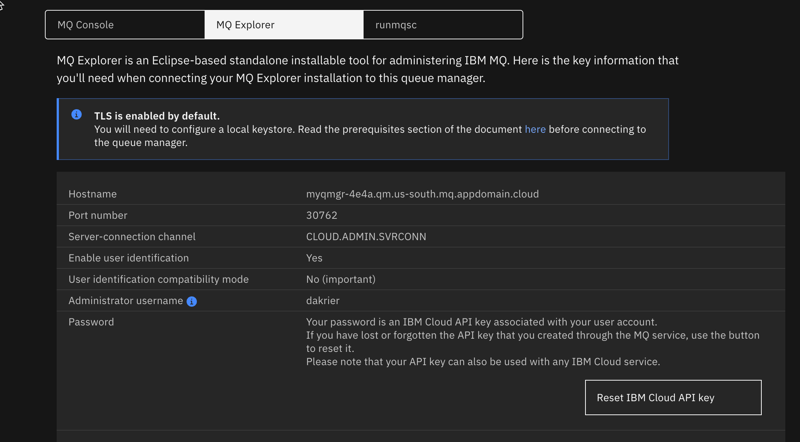
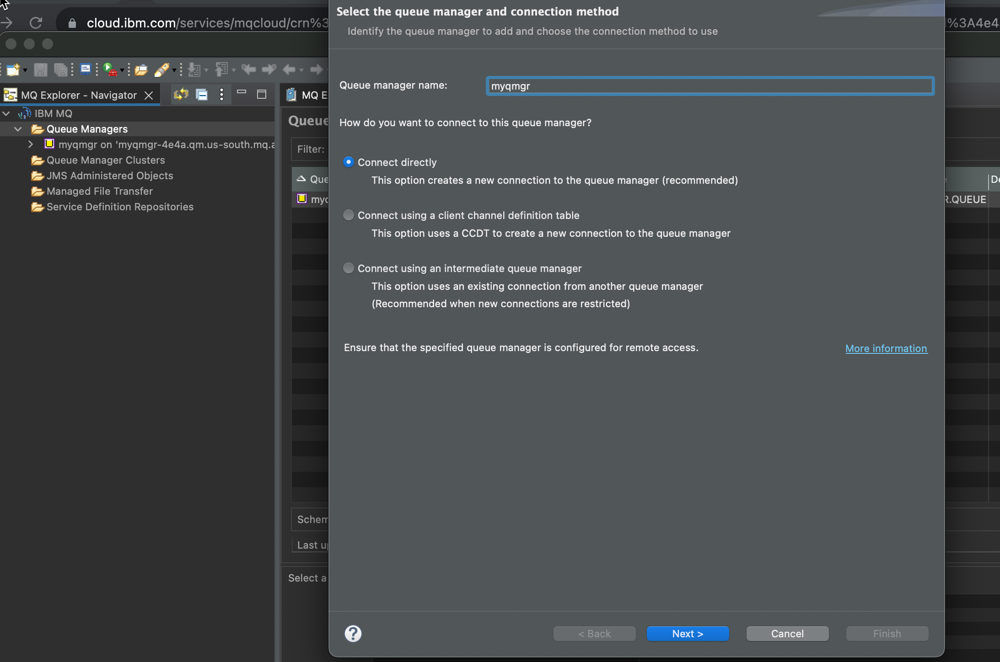
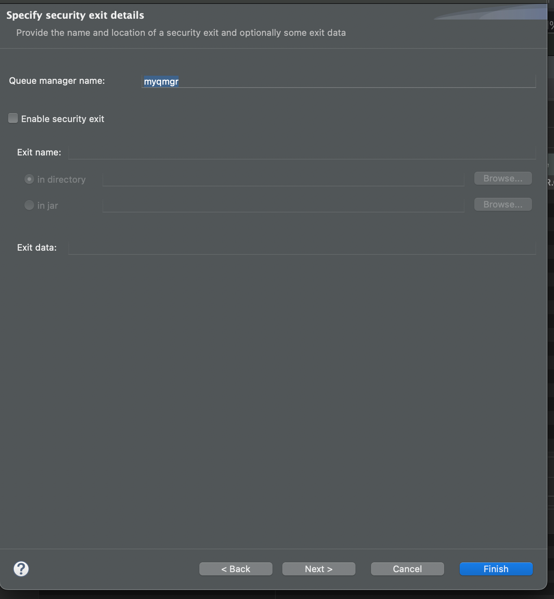
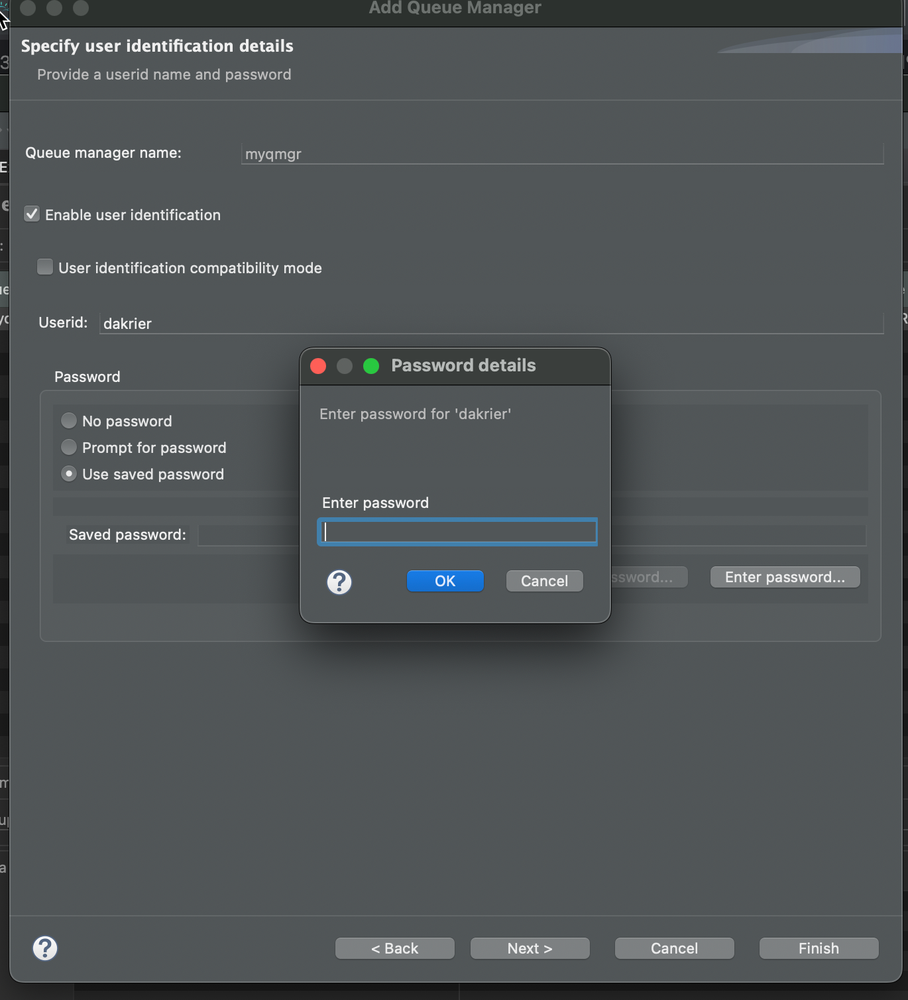
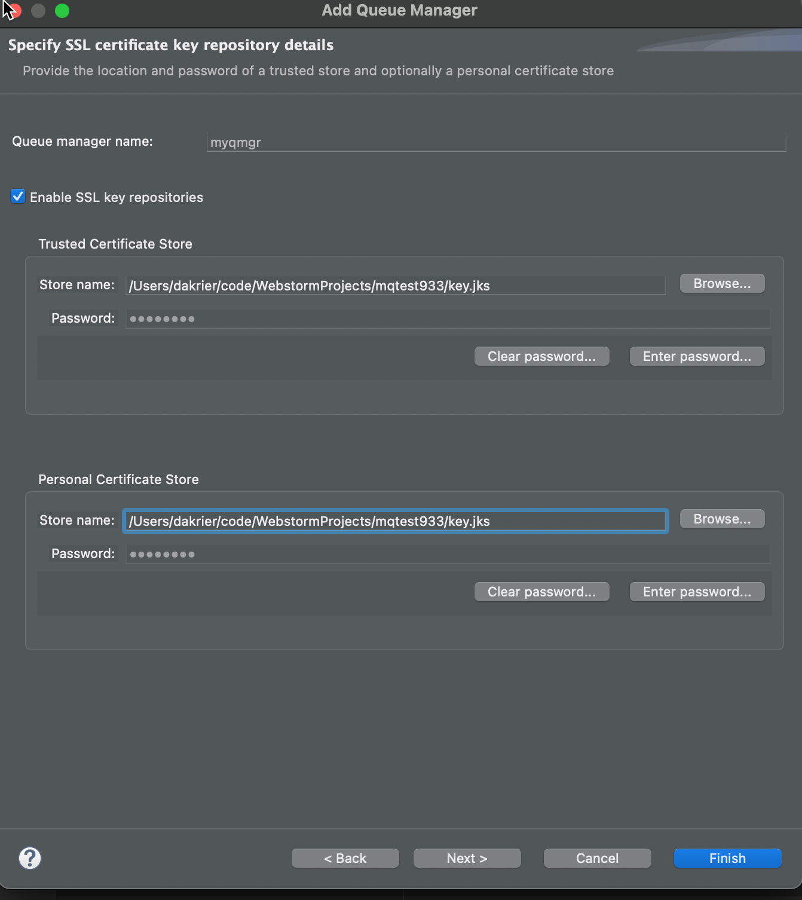
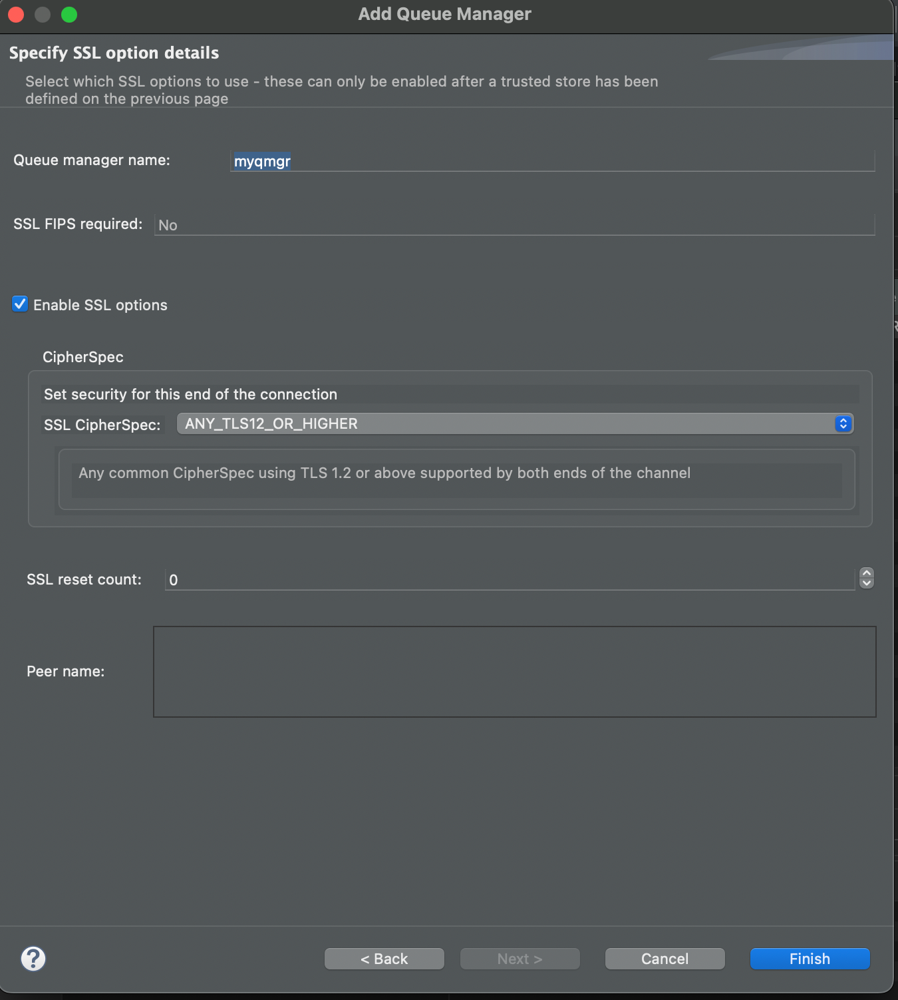

# IBM MQ Cloud – Setup & connect MQ Explorer

[Download Instructions](../pdf/How to connect IBM MQ Explorer to Remote IBM Cloud Queue Manager.pdf)

## Prerequisits 

* You have MQ Explorer installed on your remote machine. 
* You have a MQ IBM Cloud Queue Manager deployed

**NOTE:** ***MQ Explorer on a Mac is deployed as an Eclispse plugin. For Windows clients, it's a standalone application.***


## Download the Queue Manager Certificate. 

You must download the cert from the keystore on the IBM Cloud Queue Manager. The download will be in the format of a PEM file. You need to use the cert that is associated with the queue manager. 

**Note:** ***The default cert that is associated with the queue manager is labeled qmgrcert***


## Create a java keystore

Below is an example of the keytool command to convert the CERT (your downloaded pem file) into a jks keystore. 

```keytool -importcert -file qmgrcert.pem  -alias qmgrcert  -keystore key.jks -storepass YOUR_PASSWORD```

To view the keystore you can run this command below 

```Keytool -list -keystore key.jks -storepass YOUR_PASSWORD```


## Reset the IBM Cloud API Key if you do not have the key already. 

You can find a button in the bottom right hand corner when you look at the following admin screen on IBM Cloud. 

**Note:**  ***Download the apikey, you will only get one chance to view it.***



## Configure a remote queue manager in MQ Explorer

Open up MQ Explorer on your remote workstation. Right click and add a new remote queue manager. 

You will need to supply the correct connection information as showed in the below example. 





The screen shot below is where you need to enter the apikey for your admin user. This should be in the file you downloaded when you rest the API Key. 




You need to enable TLS security and point both the personal keystore and the trusted keystore to your repository, which is the jks file. 

The keystore has a password. You actually set that password in the first step. You will need to enter the password for your keystore for both the private and trusted stores. 



The ciper spec should match what you have on the MQ Server. 

Note: The default is ANY_TLS12_OR_HIGHER



You should now be able to connect. 


