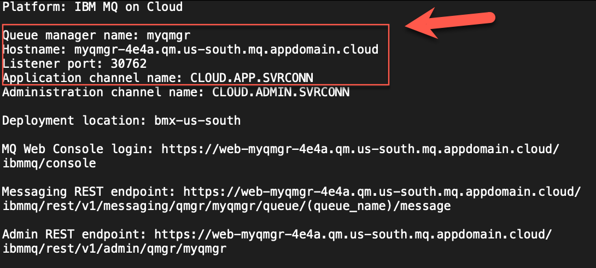
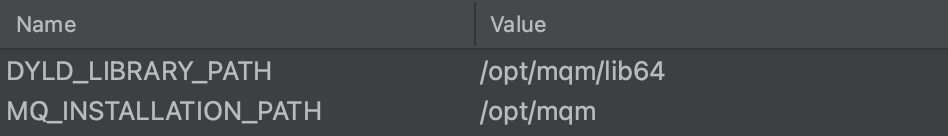

# IBM MQ Cloud – Setup & configuration to run a sample application

[Download Instructions](../pdf/How to connect IBM MQ Explorer to Remote IBM Cloud Queue Manager.pdf)

This is an example to demonstrate the configuration and setup for the IBM MQ Queue Manager and the TLS security requirements to connect.  While the sample application in this demonstration is Python, the same steps can be used for any other supported application programming language.  

## Prerequisites 

* IBM MQ Service deployed with a running queue manager ([Instructions](https://cloud.ibm.com/docs/mqcloud?topic=mqcloud-mqoc_create_qm))
* TLS Channel Security ([Reference Material](https://cloud.ibm.com/docs/mqcloud?topic=mqcloud-mqoc_configure_chl_ssl))

**Note:** *IBM Cloud MQ Service queue manager channels have been pre-configured with TLS. If this is a NEW deployment, you will not need to configure TLS security on the channels.*

* MQ Client must be installed on your local workstation (or the location where you plan to run the client app)
* For macOS, follow the steps in the ([MQ macOS Toolkit tutorial](https://developer.ibm.com/tutorials/mq-macos-dev)).
* For Windows or Linux MQ clients, download and install one from the ([IBM Support site](https://www.ibm.com/support/pages/node/712701)).
*  Python (The example application is based on Python). You will need to have Python installed on your machine to run the sample application. 

## Download the TLS Certificate and connection information from your queue manager

1-	Log into your IBM Cloud account and navigate to your  “IBM MQ Service”. You can find your services  in the resource list. 
2-	Select the queue manager you wish to connect to. 


3-	Select the Key store tab, to display the certificates associated with your queue manager. 
4-	Download the certificate by selecting the 3 dots on the certificate and selecting the “Download public certificate” button. 


5-	Copy the downloaded PEM file to your project folder, where you will run the application from. 
6-	Download the connection information for your queue manager by selecting the “Connection Information” button. 


**Note:** *You can choose the format to download. I selected plain text in my example.*


7-	Inspect the connection information. We will need the information outlined in red for connection to our queue manager. 



**TASK COMPLETE**
*You now have all the information you need to connect to this queue manager*

## Create application userid/apikey

Look here for more detailed information on how to setup userid and api key. ([Instructions](https://cloud.ibm.com/docs/mqcloud?topic=mqcloud-mqoc_configure_app_qm_access))

Our sample will use a pre-defined queue, so the authorization record has been automatically configured. See below instructions on how to configure authorization to a custom queue. 

**Note:** *If you do not intend to use one of the predefined 'DEV.QUEUE.' queues to put and get messages, follow the ([Assigning user/group access to a queue](https://cloud.ibm.com/docs/services/mqcloud?topic=mqcloud-mqoc_configure_auth_record)) guide to configure the authorization record required for this queue.*

Below are the steps that I took to create a userid / apikey. 

1-	On the main IBM MQ Service screen, select “Application Credentials” 


2- 	Select the “Add” button to create a NEW set of application credentials 


3-	Fill out the information and select “Add and generate API Key” 


**IMPORTANT:** *You will ONLY see the API KEY ONE TIME!!  Take note of this.. !!*


**TASK COMPLETE**
*This will be the Userid & Password used to authenticate to the queue manager.*

## Create the keystore for the client connection

For this next step, we need to create a keystore file and add our certificate information to the keystore. 

1-	Copy the downloaded PEM file (containing the cert) to your project directory. This was downloaded from the IBM Cloud QM Service page in a previous step. 

2-	Create the keystore with this command below. 


**Note:** *This command line tool is part of the MQ Developers Kit*

    runmqakm -keydb -create -db <keystorename>.kdb -pw <password> -type pkcs12 -expire 1000 -stash

•	**keystorename**  - You can name your keystore any name you wish
•	**password**  -  You can set the password for the keystore to anything you wish

**My Example**

```/opt/mqm/bin/runmqakm -keydb -create -db qmgrcert.kdb -pw password -type pkcs12 -expire 1000 -stash```

3-	Add the PEM (certificate) to the keystore with this command below.


**Note** *This command line tool is part of the MQ Developers Kit*

    runmqakm -cert -add -label <yourlabel> -db <keystorename>.kdb -stashed -trust enable -file <pemfilename>.pem

•	**yourlabel**  -  You can add any label you like here, but I recommend using the same name as your keystorename
•	**keystorename**  -  This must match the keystore name you created in the first command. 
•	**pemfilename** -  This must match the name of your pem file (should be in the same directory where your running this command. 

**My Example** 

```/opt/mqm/bin/runmqakm -cert -add -label qmgrcertnew1 -db qmgrcertnew1.kdb -stashed -trust enable -file qmgrcert.pem```
 
4-	Verify that you have the generated kdb and sth files 

You should see two new files that were generated by these 2 commands above. 
•	keystorname.kdb
•	keystorename.sth


**TASK COMPLETE**

*We will use the keystore files to connect to the queue manager via a channel that is TLS enabled.* 


## Test connectivity

The Python “pymqi” library requires you to have the MQ Client installed. This python library is a wrapper to the C client libraries loaded with the MQ Client. We MUST have these environment variables set. 



If you are running these on a linux or Mac machine you can set these variables via the command line using these commands. 


    export DYLD_LIBRARY_PATH=/opt/mqm/lib64
    export MQ_INSTALLATION_PATH=/opt/mqm


The PATH environment variable should include the mqm libraries. Add these directories to your path. . 


    /opt/mqm/bin:/opt/mqm/lib64:/opt/mqm/samp/bin


Below is the sample Python Application. We will need to use the connection information that was downloaded from a previous step to populate the values for the connection. 

We will also need to reference the keystore file and set the userid / password (api key) 

    import pymqi

    import logging

    queue_manager = 'myqm'
    queue_name = 'DEV.QUEUE.1'
    message = 'Hello from Python! - This is Dave Krier'

    cd = pymqi.CD()
    cd.ChannelName = b'CLOUD.ADMIN.SVRCONN'
    cd.ConnectionName = b'myqm-4e4a.qm.us-south.mq.appdomain.cloud(30000)'
    cd.ChannelType = pymqi.CMQC.MQCHT_CLNTCONN
    cd.TransportType = pymqi.CMQC.MQXPT_TCP
    cd.SSLCipherSpec = b'ANY_TLS12_OR_HIGHER'
    sco = pymqi.SCO()
    sco.KeyRepository = b'./qmgrcert' # include file name but not file extension

    qmgr = pymqi.QueueManager(None)
    qmgr.connect_with_options(queue_manager, user='davetest', password='F-5QDP8lO_cI0j7521wEchXxzd2Yv7DeA_gPqa28ASBx', cd=cd, sco=sco)

    put_queue = pymqi.Queue(qmgr, queue_name)
    put_queue.put(message)

    get_queue = pymqi.Queue(qmgr, queue_name)
    print(get_queue.get())

    put_queue.close()
    get_queue.close()

    qmgr.disconnect()


## References

*	[https://developer.ibm.com/tutorials/mq-secure-msgs-tls/#step-1-create-tls-objects](https://developer.ibm.com/tutorials/mq-secure-msgs-tls/#step-1-create-tls-objects)
*   [https://stackoverflow.com/questions/14010551/how-to-convert-between-bytes-and-strings-in-python-3](https://stackoverflow.com/questions/14010551/how-to-convert-between-bytes-and-strings-in-python-3)
*   [https://cloud.ibm.com/docs/mqcloud?topic=mqcloud-mqoc_connect_app_qm](https://cloud.ibm.com/docs/mqcloud?topic=mqcloud-mqoc_connect_app_qm)
*   [https://zato.io/pymqi/examples.html](https://zato.io/pymqi/examples.html)
*   [https://developer.ibm.com/learningpaths/ibm-mq-badge/](https://developer.ibm.com/learningpaths/ibm-mq-badge/)
