# IBM MQ Cloud – Setup & configuration to run a sample application

[Download Instructions](../pdf/How to setup TLS security with dotNET Core Managed Connection.pdf)

This is an example to demonstrate the configuration and setup for the IBM MQ Queue Manager and the TLS security requirements to connect using a .NET Core MANAGED client. 

## Specifications 

* IBM MQ Service on IBM Cloud V 9.3.3.2
* IBM MQ dotNet Client V 9.3.3.1
* Windows Client Machine (I used Windows 2022 Server for my testing)

## Prerequisites

•	Deploy IBM MQ Service in IBM Cloud. (The lite service will work)
•	Deploy a Queue Manager within your Cloud MQ service
•	Windows Client Machine
o	Install openssl
o	Install Visual Studio Developer Edition
o	Install IBM MQ Client V9.3.3.1


* IBM MQ Service deployed with a running queue manager ([Instructions](https://cloud.ibm.com/docs/mqcloud?topic=mqcloud-mqoc_create_qm))
* TLS Channel Security ([Reference Material](https://cloud.ibm.com/docs/mqcloud?topic=mqcloud-mqoc_configure_chl_ssl))

**Note:** *IBM Cloud MQ Service queue manager channels have been pre-configured with TLS. If this is a NEW deployment, you will not need to configure TLS security on the channels.*

* MQ Client must be installed on your local workstation (or the location where you plan to run the client app)
* For Windows or Linux MQ clients, download and install one from the ([IBM Support site](https://www.ibm.com/support/pages/node/712701)).
* Windows Client Machine
    * Install openssl
    * Install Visual Studio Developer Edition
    * Install IBM MQ Client V9.3.3.1


## Enable SSL on your Windows Client

You MUST have SSL policy enabled on your client machine. To ensure that you have this setup please run gpedit.exe and verify. 


**If the above setting is not enabled, you will need to enable this.**


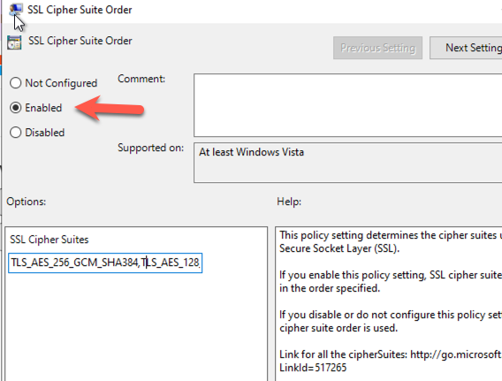


**NOTE**:  ***You can leave the default cipher Suites order field to the default setting. We just need to make sure that we are using one of the values in this filed when we make a connection with the client application.***

## Create SSL Cert / Key 

You will need to create a ssl cert and key using the below command. To do this you need to have openssl installed in your machine. 

***Example Command***

```openssl req -newkey rsa:2048 -nodes -keyout krierclientKey.pem -x509 -days 365 -out krierclientCert.pem```

Below is an example of the settings I used. The only thing that is important to note on this is the FQDN name. You need to set this to the fully qualified domain name (host name) of your MQ Server. You can find this information in the connection information for your queue manager in the cloud. 


## Combine the Cert / Key into a single PEM file

Combine the private key and public certificate into a single file

```
cat krierclientKey.pem > Krier.pem
cat krierclientCert.pem >> Krier.pem
```

**Note:** ***if you are doing this on a windows machine, you can use a text editor to create a new file and paste the contents of the two PEM files into a NEW PEM file.***

## Create the pfx (pk12) file for the Windows Cert Store


```openssl pkcs12 -export -out krier.pfx -in krier.pem```

**Note:** ***We will use this new singe PEM file with both the key and the cert on the IBM Public Cloud Queue Manager.***


## Import the pfx file into BOTH personal key store and Windows Trust Store 

On your Windows client, you will need to run the MMC to modify the certificates for windows. 

From the run menu, type mmc and hit enter.  Open this app below. 


From the file menu, select Add Remove Snap In and select the Certificates from the left hand menu option. Add that to the snap in and select OK. 

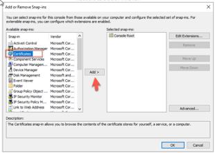

In our example, we will be using the Local Computer (*SYSTEM) keystore repository. 

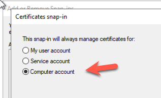

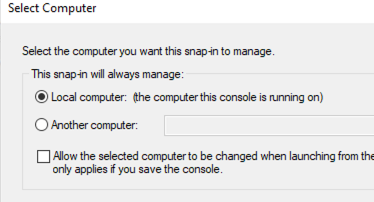


We need to add our pfx file to BOTH the personal repository and the trusted repository. 

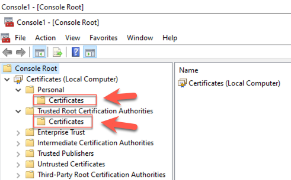

Right click on the Personal/Certificates folder and select the option to import


Select the pfx file we created in the previous step.. 


You should now see that in your personal key store. 

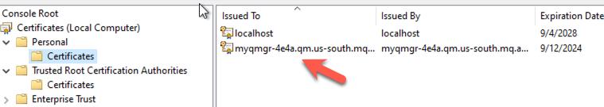

Modify the label (friendly name of the cert you just imported) 

Right click on the cert in your keystore. Select properties. 


**This is VERY IMPORTANT**.. Give your cert a friendly name in this format. 

```ibmwebspheremq   +  <The USERID of your Windows User who will be running the Application>```

**Note:** ***I am logged in with the administrator userid, so that’s what I used in my example below.*** 


**IMPORTANT.**.** ***You need to perform the same steps to import the pfx file into the Trusted Root Certification Authorities keystore***


## Import the PEM into the keystroke for the QM on the cloud. 

Log into your queue manager on the IBM Cloud. 

Select the Key Store tab from the management console

Select IMPORT

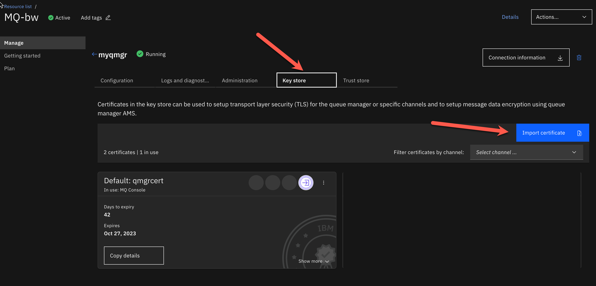

Browse to locate your PEM file. This will be the PEM file with your cert & key.. In my example it’s the krier.pem file. 

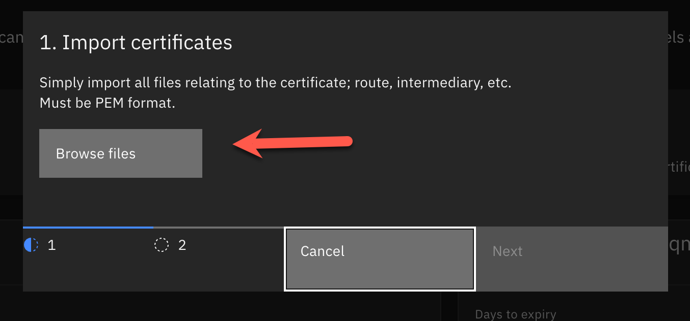

Give your cert a name (Lable). This is important to label it correctly. .

You need to label it as follows. 

ibmwebspheremq   +  **YOUR QUEUE MANAGER NAME - all lower case**


Now we need to ensure that the cert is used for our channels. 

Select the 3 dots for the qert to see the management button. 


Select to use this cert for the channels you are connecting to. In our case it’s both of these channels below. 


## Create an USERID that will be used for channel authentication. 

On the initial page for your IBM Cloud MQ Service, you will have the option to create a new application credential. 


Create an application credential. 

Take note of your APIKEY, that will be your password when connecting. 

## Modify the SSL of the QM qm.ini  Queue Manager configuration. 

Next we need to make a few updates to our queue manager settings. Log into the MQ Console

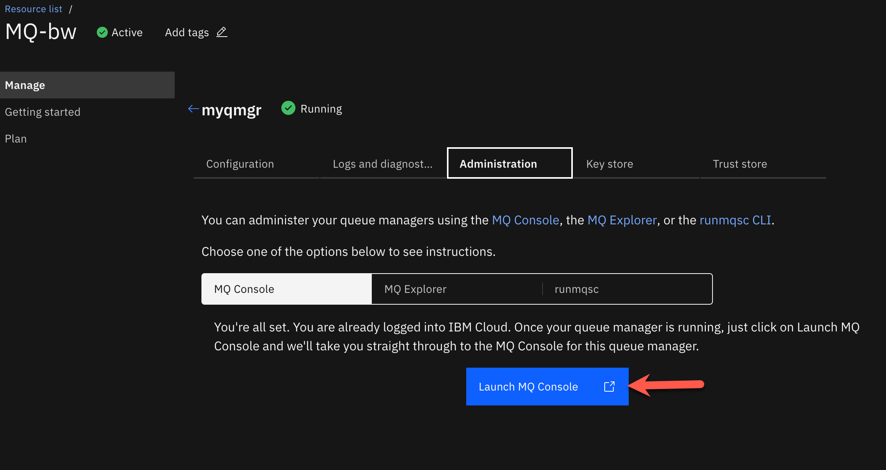

Select manage on the left hand side to bring up the management console. 

Select the “view configuration” link in the upper right hand corner. 


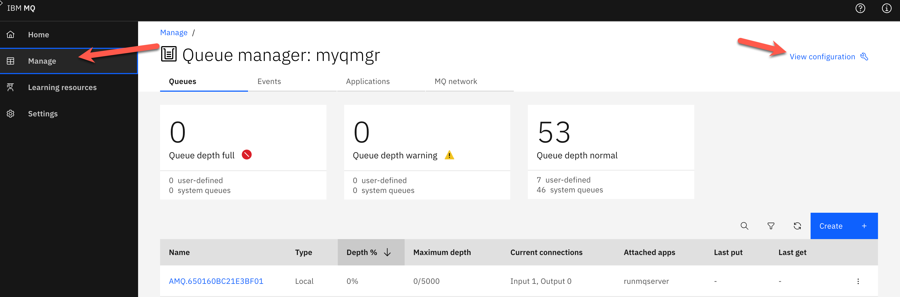

**Edit the SSL settings for the channel** 

Verify the Certlabel property is set to your correct cert for the queue manager. In our case the cert for the queue manager is "qmgrcert". 


The queue manager certs, which we have 2 defined. 


The channel SSL cert should label should be BLANK as displayed below. This setting can be found on the application channel settings. 


Any time  you change the TLS certs, we need to make sure these settings are picked up by the queue manager. You need to refresh the TLS configuration. 


## Refresh TLS Security

At the top of the configuration page you will see a ACTION button. 

Select the button and refresh the TLS settings


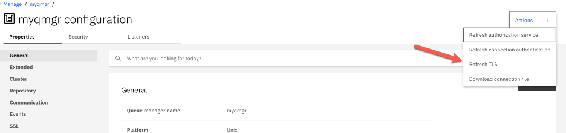

## Get your connection information for your queue manager

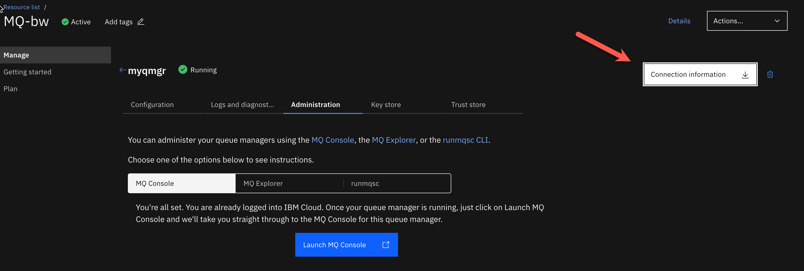


We will need this information for our application. 

Running a Sample Client .NET App

I am using Visual Studio code to test my applications. You need to use the IBM MQ .Net client library to connect. You have 2 options to setup your project to use the MQ Client libraries. 

### Option 1. Add a reference to the amdmdnetstd.dll from the installed windows mq client. 


After you add this reference you should see it in your project as displayed below. 

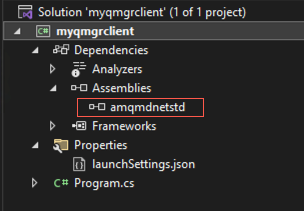

The advantage of this option is that you can run MQ Client Tracing, to help you debug. 

### Option 2.  You can use nuGet from Visual Studio IDE to add the IBM MQ Client to your project. 

Search for packages from IBM and you will find the IBMMQDotnetClient package. 


## Sample code ##

```
using IBM.WMQ;
using System;
using System.Collections;
using System.Text;

namespace myqmgrclient
{
    internal class Program
    {
        static void Main(string[] args)
        {
            string strQueueManagerName = "myqmgr";
            string strChannelName = "CLOUD.APP.SVRCONN";
            string strQueueName = "DEV.QUEUE.1";
            string strServerName = "myqmgr-4e4a.qm.us-south.mq.appdomain.cloud";
            int intPort = 30762;
            string strMsg = "Hello IBM, this is a message";


             Hashtable queueProperties = new Hashtable
            {
                { MQC.HOST_NAME_PROPERTY, strServerName },
                { MQC.CHANNEL_PROPERTY, strChannelName },
                { MQC.PORT_PROPERTY, intPort },
                { MQC.CONNECT_OPTIONS_PROPERTY, MQC.MQCNO_RECONNECT },
                { MQC.TRANSPORT_PROPERTY, MQC.TRANSPORT_MQSERIES_MANAGED },
                { MQC.SSL_CERT_STORE_PROPERTY, "*SYSTEM" },
                { MQC.SSL_CIPHER_SPEC_PROPERTY, "TLS_RSA_WITH_AES_128_CBC_SHA256" }
            };

            //Set Username
            MQEnvironment.UserId = "davetest";

            //Set Passowrd
            MQEnvironment.Password = "F-5QDP8lO_cI0j7521wEchXxzd2Yv7DeA_gPtttqa28ASBV";

            //Define a Queue Manager
            try
            {
                Console.WriteLine(Environment.UserName.ToLower());
                Console.WriteLine(MQEnvironment.CertificateLabel);
                MQQueueManager myQM =
                       new MQQueueManager(strQueueManagerName, queueProperties);

                // creating a message object 
                MQMessage queueMessage = new MQMessage();
                queueMessage.WriteString("test message");

                //Define a Queue
                var queue = myQM.AccessQueue
                (strQueueName, MQC.MQOO_OUTPUT + MQC.MQOO_FAIL_IF_QUIESCING);
                MQPutMessageOptions queuePutMessageOptions = new MQPutMessageOptions();
                queue.Put(queueMessage, queuePutMessageOptions);
                queue.Close();
                Console.WriteLine("Success");
            }
            catch (Exception ex)
            {
                Console.WriteLine(ex);
                Console.WriteLine(ex.Message);
            }
            Console.ReadLine();
        }
    }
}
```

**Note:** ***There are more samples provided with the MQ Client.***

```Location: C:\Program Files\IBM\MQ\tools\dotnet\samples\```

## Debugging – Connectivity Issues.. 

On the Client Application 

I would highly recommend you turn on MQ Tracing for your windows client. 

**IMPORTANT:**  ***This requires you to reference the IBM MQ Client DLL from the installed MQ Client on your local windows machine.***

You will need to set 3 environment variables for your application. 

Select the debug menu and then select debug properties to show this window below. Set the environment variables. 

**NOTE:**  ***You need to close down Visual Studio and reopen it to get the variables to be picked up by the editor.***

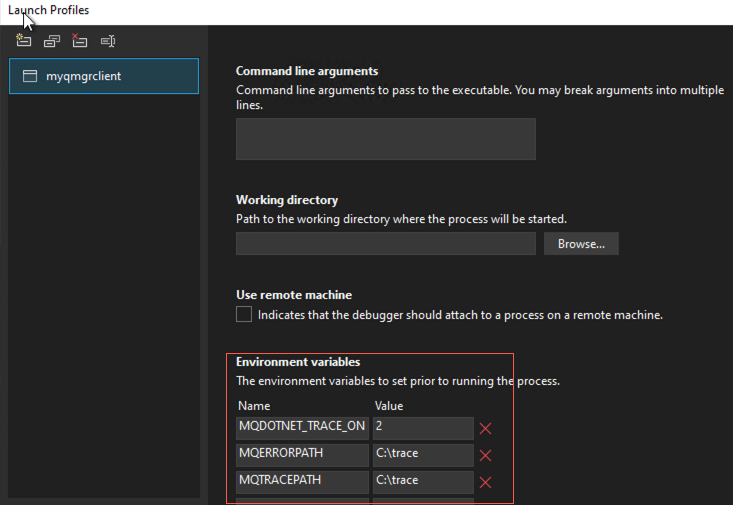

On the MQ Server. 

You can see any connection errors in the logs on the server. Below is a screen shot of the logs. 


## References

* [Connecting to IBM MQ with SSL Article](https://www.codeproject.com/Tips/5268164/Connecting-to-IBM-MQ-with-SSL)
* [How to import intermediate and root certificates via MMC](https://www.ssls.com/knowledgebase/how-to-import-intermediate-and-root-certificates-via-mmc/)
* [Troubleshooting MQ SSL](https://www.ibm.com/support/pages/ibm-mq-troubleshooting-common-tls-ssl-errors#9665)
* [Sample code repository](https://github.com/ibm-messaging/mq-dev-patterns/tree/master/dotnet)
* [Download – Sample instructions for SSL](https://community.ibm.com/HigherLogic/System/DownloadDocumentFile.ashx?DocumentFileKey=10233c6b-1d3b-290d-4579-a416148437be&forceDialog=0)
* [Python SSL Unmanaged .Net Framework Sample How To](https://djk-assets.github.io/library/mq/IBMCloud_MQ_Python_TLS/)
* [MQ Documentation – Configure TLS for Managed .NET App](https://www.ibm.com/docs/en/ibm-mq/9.3?topic=client-configuring-tls-managed-mq-net)
* [Cyper Spec for MQ Information](https://www.ibm.com/docs/en/ibm-mq/8.0?topic=mq-cipherspec-values-supported-in)
* [Key Repository’s for Managed .Net Applications](https://www.ibm.com/docs/en/ibm-mq/9.3?topic=client-key-repositories-managed-net)
* [Running .Net Core application on Linux](https://community.ibm.com/community/user/integration/viewdocument/running-mq-net-core-ssl-applicatio?CommunityKey=183ec850-4947-49c8-9a2e-8e7c7fc46c64&tab=librarydocuments)
* [How to perform common IBM Management Cert Tasks](https://www.ibm.com/support/pages/how-perform-common-ibm-mq-management-certificate-tasks#9624)
* [IBM MQ in Kubernetes – Enabling TLS with signed CA](https://community.ibm.com/community/user/integration/blogs/atul-sharma/2022/01/06/ibm-mq-in-kubernetes-enabling-tls)
* [Generating PK12 Certs ](https://www.ibm.com/docs/en/api-connect/5.0.x?topic=profiles-generating-pkcs12-file-certificate-authority)
* [Creating self signed Certs for use with IBM MQ on Cloud](https://www.ibm.com/docs/en/ibm-mq/9.3?topic=wsalw-creating-self-signed-personal-certificate-aix-linux-windows)
* [Stack Overflow – 2393 Error - Resolution](https://stackoverflow.com/questions/76536333/2393-mqrc-ssl-initialization-error-after-migrating-from-amqmdnet-dll-to-amqmdnet)
* [Stack Overflow – MQ TLS Error Resolution with Tracing](https://stackoverflow.com/questions/68416230/unable-to-connect-to-ibm-mq-with-tls-using-net-standard-library)
* [How to create a PEM file](https://www.suse.com/support/kb/doc/?id=000018152)
* [Documentation – Understanding the Certificate Label Requirements](https://www.ibm.com/docs/en/ibm-mq/9.3?topic=repository-digital-certificate-labels-understanding-requirements)
* [How to create a pfx file from cert and private key](https://stackoverflow.com/questions/6307886/how-to-create-pfx-file-from-certificate-and-private-key)	

