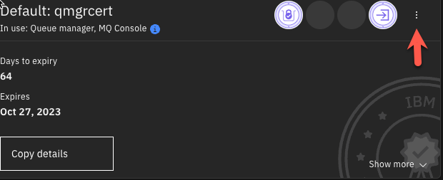
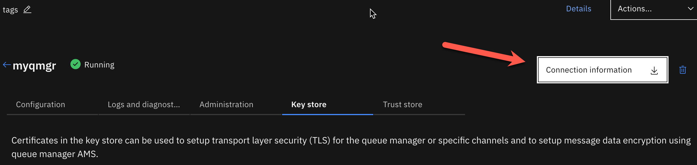
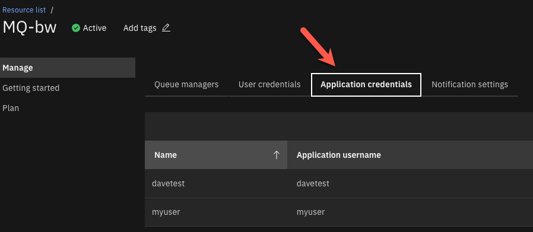
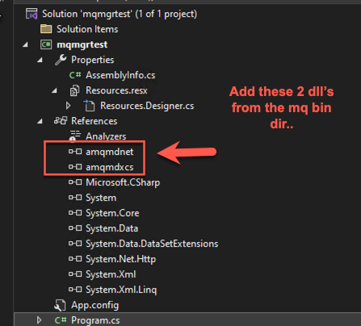
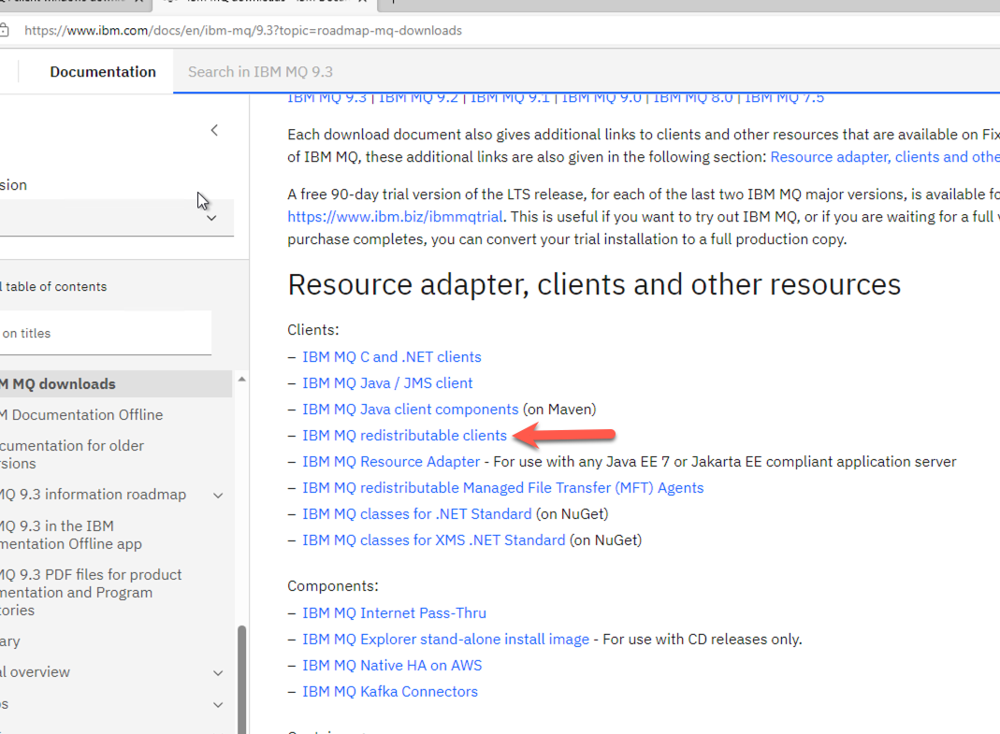
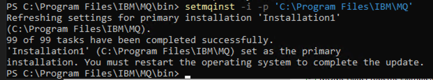

# Enabling TLS for the unmanaged .NET Framework client

[Download Instructions](../pdf/Enabling TLS for the unmanaged dotNet Framework Client.pdf)

This is an example to demonstrate the configuration and setup for the IBM MQ Queue Manager and the TLS security requirements to connect using a dotNet Freamework applciation. 

**Note:** ***The .NET frame work IBM MQ libraries allow you to connect to MQ using an unmanaged MQ Connection. This allows you to connect by using your own keystore file (kdb). Just note that the .NET Core libraries require you to use a managed connection (managed means you have to use the Windows Authority Keystore).***

## Prerequisites 

* IBM MQ Queue Manager in the IBM Cloud
* Windows Client 
    * MQ Dot Net Client
    * Visual Studio Community Edition 

## Download the TLS Certificate and connection information from your queue manager in the cloud

1.	Log into your IBM Cloud account and navigate to your  “IBM MQ Service”. You can find your services  in the resource list. 
2.	Select the queue manager you wish to connect to. 


3.	Select the Key store tab, to display the certificates associated with your queue manager. 

4.	Download the certificate by selecting the 3 dots on the certificate and selecting the “Download public certificate” button. 




5.	Copy the downloaded PEM file to your project folder, where you will run the application from. 
6.	Download the connection information for your queue manager by selecting the “Connection Information” button. 



You can choose the format to download. I selected plain text in my example. 


7.	Inspect the connection information. We will need the information outlined in red for connection to our queue manager. 


**TASK COMPLETE**
You now have all the information you need to connect to this queue manager

## Create application userid/apikey

Look here for more detailed information on how to setup userid and api key. [Instructions](https://cloud.ibm.com/docs/mqcloud?topic=mqcloud-mqoc_configure_app_qm_access)

Our sample will use a pre-defined queue, so the authorization record has been automatically configured. See below instructions on how to configure authorization to a custom queue. 

**Note:**  ***If you do not intend to use one of the predefined 'DEV.QUEUE.' queues to put and get messages, follow the [Assigning user/group access to a queue](https://cloud.ibm.com/docs/services/mqcloud?topic=mqcloud-mqoc_configure_auth_record) guide to configure the authorization record required for this queue.
Below are the steps that I took to create a userid / apikey.***

**Below are the steps that I took to create a userid / apikey.**

1.)	On the main IBM MQ Service screen, select “Application Credentials” 




2.)	Select the “Add” button to create a NEW set of application credentials 


3.)	Fill out the information and select “Add and generate API Key” 


**IMPORTANT:**  ***You will ONLY see the API KEY ONE TIME!!  Take note of this.. !!***



**TASK COMPLETE**
This will be the Userid & Password used to authenticate to the queue manager. 

## Create the keystore for the client connection

For this next step, we need to create a keystore file and add our certificate information to the keystore. 

1.)	Copy the downloaded PEM file (containing the cert) to your project directory. This was downloaded from the IBM Cloud QM Service page in a previous step. 

2.)	Create the keystore with this command below. 

**Note:**  ***This command line tool is part of the MQ Client***

   Location is here on my machine: ```C:\Program Files\IBM\MQ\bin```

```runmqakm -keydb -create -db <keystorename>.kdb -pw <password> -type pkcs12 -expire 1000 -stash```

* **keystorename**  - You can name your keystore any name you wish
* **password**  -  You can set the password for the keystore to anything you wish

**My Example** 

```<MQ Client Install>IBM/MQ/bin/runmqakm -keydb -create -db qmgrcert.kdb -pw password -type pkcs12 -expire 1000 -stash```

3.)	Add the PEM (certificate) to the keystore with this command below.

```runmqakm -cert -add -label <yourlabel> -db <keystorename>.kdb -stashed -trust enable -file <pemfilename>.pem```

* **yourlabel**   You can add any label you like here, but I recommend using the same name as your keystorename
* **keystorename**   This must match the keystore name you created in the first command. 
* **pemfilename**  This must match the name of your pem file (should be in the same directory where your running this command. 

**My Example**

```<MQ Client Install>IBM/MQ/bin/runmqakm -cert -add -label qmgrcert -db qmgrcert.kdb -stashed -trust enable -file qmgrcert.pem```

4.)	Verify that you have the generated kdb and sth files 

You should see two new files that were generated by these 2 commands above. 

* **keystorname**.kdb
* **keystorename**.sth

**TASK COMPLETE**

We will use the keystore files to connect to the queue manager via a channel that is TLS enabled. 

## Add MQ Client dll’s to your project. 

Configure your .Net Framework Application to include these two dll’s from the MQ Client bin folder. 

My location:  ```C:\Program Files\IBM\MQ\bin```


## Sample .Net Framework Code

You will need to modify the sample code to include your connection information and the location of your kdb keystore file. 

**Note:** ***You will need to omit the file extension (.kdb) for the keystore property.***

```
using System;
using System.Collections.Generic;
using System.Linq;
using System.Text;
using System.Threading.Tasks;
using IBM.WMQ;
using System.Collections;
using System.Runtime.Remoting.Messaging;

namespace mqmgrtest
{
    internal class Program
    {
        static void Main(string[] args)
        {
            string strQueueManagerName = "myqmgr";
            string strChannelName = "CLOUD.ADMIN.SVRCONN";
            string strQueueName = "DEV.QUEUE.1";
            string strServerName = "myqmgr-4e4a.qm.us-south.mq.appdomain.cloud";
            int intPort = 30762;
            string strMsg = "Hello IBM, this is a message";

            Hashtable queueProperties = new Hashtable
            {
                { MQC.HOST_NAME_PROPERTY, strServerName },
                { MQC.CHANNEL_PROPERTY, strChannelName },
                { MQC.PORT_PROPERTY, intPort },
                { MQC.SSL_CIPHER_SUITE_PROPERTY, "TLS_RSA_WITH_AES_128_CBC_SHA256" },
                { MQC.SSL_CIPHER_SPEC_PROPERTY, "TLS_RSA_WITH_AES_128_CBC_SHA256" },
                { MQC.USER_ID_PROPERTY, "davetest" },
                { MQC.PASSWORD_PROPERTY, "F-5QDP8lO_cI0j7521wEchXxzd2Yv7DeA_gPqa28ASBV" },
                { MQC.TRANSPORT_PROPERTY, MQC.TRANSPORT_MQSERIES_CLIENT },
                { MQC.SSL_CERT_STORE_PROPERTY, "C:/Users/Administrator/mq-dev-patterns-master/mq-dev-patterns-master/dotnet/keys/qmgrcert" }
            };

            //Define a Queue Manager
            try
            {
                MQQueueManager myQM =
                       new MQQueueManager(strQueueManagerName, queueProperties);

                MQMessage queueMessage = new MQMessage();

                //Define a Message (Option 1)
                queueMessage.Format = MQC.MQFMT_STRING;
                queueMessage.CharacterSet = Encoding.UTF8.CodePage;
                queueMessage.Write(Encoding.UTF8.GetBytes(strMsg));

                //Define a Message (Option 2)
                //var message = new MQMessage();
                //String messageString = "test message";
                //queueMessage.WriteString("test message");

                //Define a Queue
                var queue = myQM.AccessQueue
                (strQueueName, MQC.MQOO_OUTPUT + MQC.MQOO_FAIL_IF_QUIESCING);
                MQPutMessageOptions queuePutMessageOptions = new MQPutMessageOptions();
                queue.Put(queueMessage, queuePutMessageOptions);
                queue.Close();
                Console.WriteLine("Success");
            }
            catch (Exception ex)
            {
                Console.WriteLine(ex);
                Console.WriteLine( ex.Message);
            }
            Console.ReadLine();
        }
    }
}
```

## Resources


[](https://www.ibm.com/docs/en/ibm-mq/9.0?topic=client-enabling-tls-unmanaged-net)





[](https://www.ibm.com/docs/en/ibm-mq/9.3?topic=roadmap-mq-downloads)

Where to download the MQ Client files


This one below is what I recommend you install. 


## Extra credit


[](https://www.ibm.com/docs/en/ibm-mq/9.3?topic=multiplatforms-dead-letter-queue-handler-sample)


[](https://www.ssls.com/knowledgebase/how-to-import-intermediate-and-root-certificates-via-mmc/)

Converting PEM to PFX

```
openssl pkcs12 -inkey bob_key.pem -in bob_cert.cert -export -out bob_pfx.pfx
```

OpenSSL Install on Windows
[](https://thesecmaster.com/procedure-to-install-openssl-on-the-windows-platform/)


[](https://github.com/ibm-messaging/mq-dev-patterns/tree/master/dotnet)
[](https://community.ibm.com/community/user/integration/viewdocument/ssl-connection-in-managed-mq-net?CommunityKey=183ec850-4947-49c8-9a2e-8e7c7fc46c64&tab=librarydocuments&_gl=1*17bzya6*_ga*MjcxNzY4OTkxLjE2OTI5NzU5NDc.*_ga_FYECCCS21D*MTY5MzU5MzQ3OC4zNC4xLjE2OTM1OTQyMDQuMC4wLjA.)
	

[](https://www.ibm.com/docs/en/ibm-mq/9.2?topic=windows-installing-mq-client)



[](https://www.ibm.com/docs/en/ibm-mq/9.3?topic=ccqms-using-self-signed-certificates-mutual-authentication-client-queue-manager)